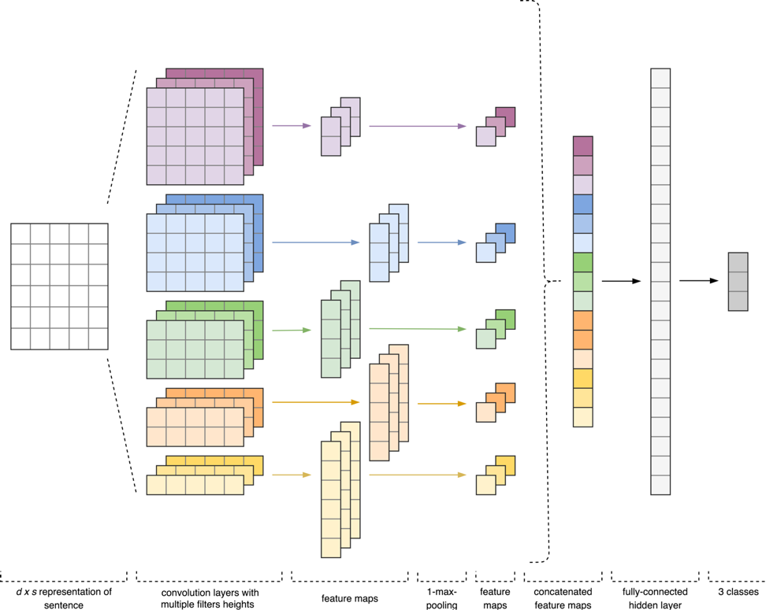

# Sentiment Analysis of Tweets in Russian using Convolutional Neural Network with Word2Vec Word Embeddings

This repository contains the source code for binary sentiment analysis of tweets in Russian using CNN. Word2Vec was used in order to set up pre-trained word embeddings for one-layer convolutional neural network, which was constructed using Keras with TensorFlow backend. Experiments showed F-measure score up to 78.14%.


*The CNN architecture was inspired by approaches described in [3] and [4].*

Citation:
```
@INPROCEEDINGS{Smetanin-SA-2019,
  author={Sergey Smetanin and Michail Komarov},
  booktitle={2019 IEEE 21st Conference on Business Informatics (CBI)},
  title={Sentiment Analysis of Product Reviews in Russian using Convolutional Neural Networks},
  year={2019},
  volume={01},
  number={},
  pages={482-486},
  doi={10.1109/CBI.2019.00062},
  ISSN={2378-1963},
  month={July}
}
```

## Data
The corpus of short texts in Russian based on Twitter messages is available at [http://study.mokoron.com/](http://study.mokoron.com/) (and also described in [1]). The files positive.csv and negative.csv contain positively labelled and negatively labelled tweets, respectively.

## Trained Models
To download trained CNN and Word2Vec models for Russian, please follow the link [https://drive.google.com/open?id=13F4kn-DSmgDTc_6sjWubYKRCxvfoDSih](https://drive.google.com/open?id=13F4kn-DSmgDTc_6sjWubYKRCxvfoDSih).

## References
1. Y. Rubtsova, "Constructing a Corpus for Sentiment Classification Training", Software & Systems, vol. 109, no. 1, pp. 72-78, 2015.
2. T. Mikolov, I. Sutskeve, K. Chen, G. Corrado and J. Dean, "Distributed Representations of Words and Phrases and their Compositionality", Advances in Neural Information Processing Systems, vol. 26, pp. 3111-3119, 2013.
3. Y. Zhang and B. Wallace, "A Sensitivity Analysis of (and Practitioners' Guide to) Convolutional Neural Networks for Sentence Classification", arXiv preprint arXiv:1510.03820, 2015.
4. M. Cliche, "BB_twtr at SemEval-2017 Task 4: Twitter Sentiment Analysis with CNNs and LSTMs", Proceedings of the 11th International Workshop on Semantic Evaluation (SemEval-2017), pp. 573-580, 2017.

## Documentation and How to report bugs
* Keras documentation: [https://keras.io/](https://keras.io/).
* Gensim documentatiob: [https://radimrehurek.com/gensim/](https://radimrehurek.com/gensim/). 
* Scikit-learn documentation: [http://scikit-learn.org/stable/documentation.html](http://scikit-learn.org/stable/documentation.html). 
* If you find any issues, please open a bug here on GitHub.

## License
See [LICENSE](LICENSE).
